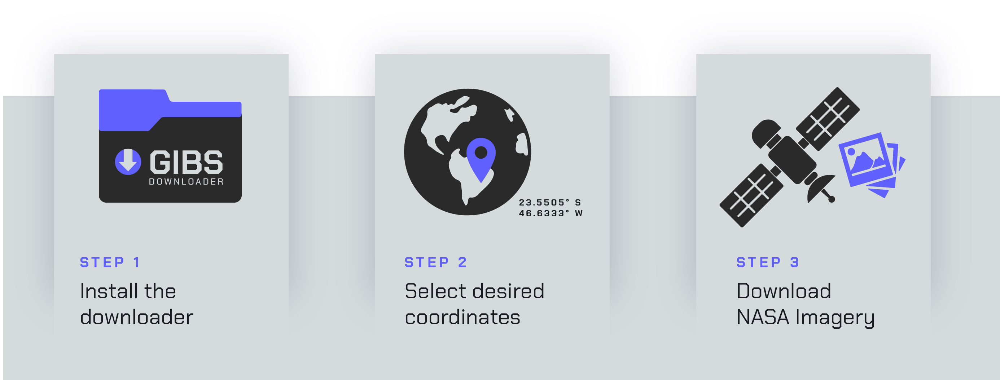
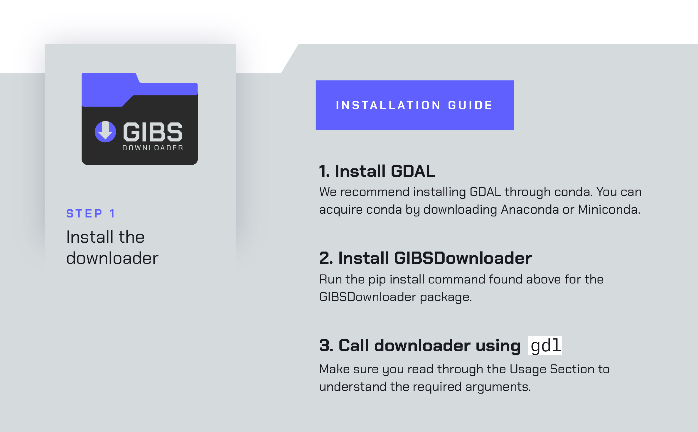
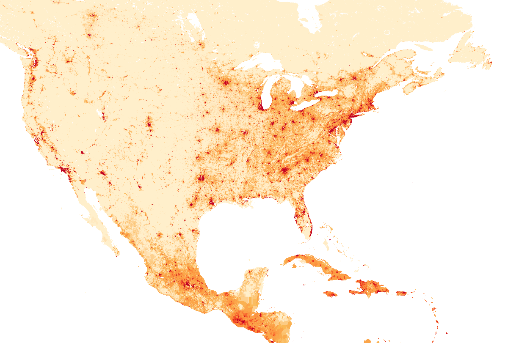
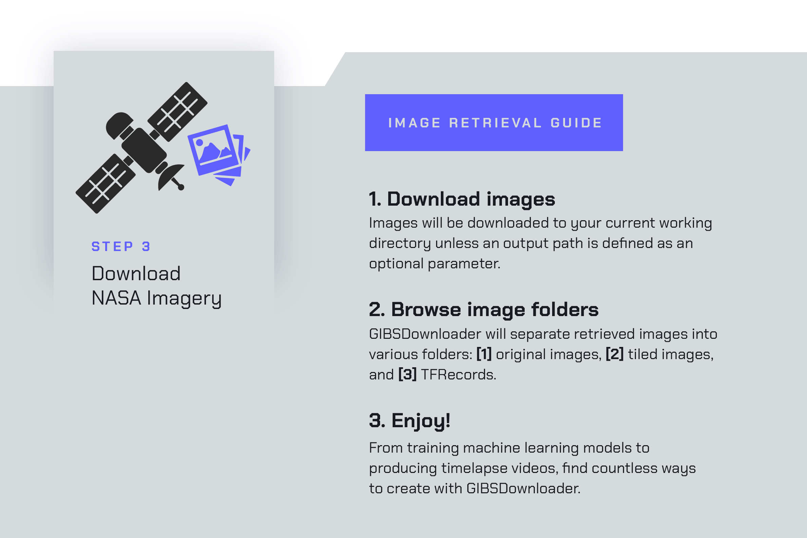
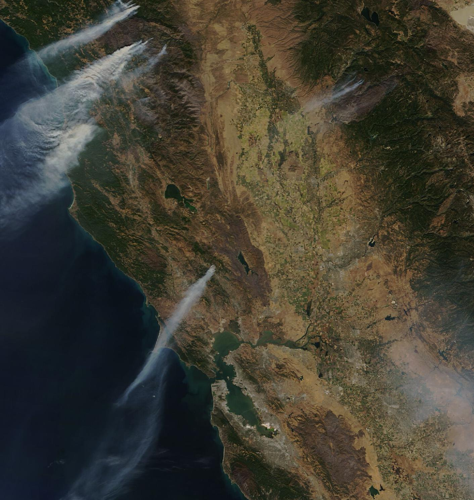

<div align="center">


<p align="center">
  Published by <a href="http://spaceml.org/">SpaceML</a> •
  <a href="https://arxiv.org/abs/2012.10610">About SpaceML</a> •
  <a href="https://github.com/spaceml-org/GIBS-Downloader/blob/main/notebooks/GIBS_Downloader_Demo.ipynb">Colab Notebook Example</a>
</p>


[](https://www.python.org/)


[](https://pypi.org/project/pip/)
[](https://github.com/spaceml-org/GIBS-Downloader/blob/main/notebooks/GIBS_Downloader_Demo.ipynb)

</div>

# GIBS Downloader
GIBS Downloader is a command-line tool which facilitates the downloading of NASA satellite imagery and offers different functionalities in order to prepare the images for training in a machine learning pipeline. The tool currently provides support for NASA GIBS imagery products found [here](https://wiki.earthdata.nasa.gov/display/GIBS/GIBS+Available+Imagery+Products).  
\
E.g. you can download images of the first week of the 2020 California wildfires as follows:  
`gdl 2020-08-16 2020-08-22 "37.003277, -124.328539" "40.353784, -120.253964"`   
\
Read further for more explanation on how to get the most out of GIBS Downloader.



## Dependencies 
This package depends on the GDAL translator library. Unfortunately, GDAL is not pip installable. Before installing the GIBS Downloader package and thus the GDAL Python binding, you have to install GDAL on your machine. I have found that one of the easiest ways to do this is with conda. After installing conda from either [Ananconda](https://www.anaconda.com/products/individual) or [Miniconda](https://docs.conda.io/en/latest/miniconda.html), create a conda environment in which you will use the GIBS Downloader, and then install GDAL as follows: ``conda install -c conda-forge gdal=3.2.0``.


## Installation 
Once GDAL is installed on your machine, the GIBS Downloader package can be installed using: `pip install git+https://github.com/spaceml-org/GIBS-Downloader.git#egg=GIBSDownloader`  
Once installed, the packaged can be referenced as `gdl` on the command-line.  
\
**NOTE:** this package must be installed in the same environment in which you installed GDAL.



## Usage


### Positional Arguments
There are four required positional arguments which are as follows:
`start-date` (dates entered as `YYYY-MM-DD`), `end-date`, `bottom-left-coords`, `top-right-coords`. The first two arguments establish a range of dates to download the images, and the last two arguments form the bottom left and top right coordinates of the desired rectangular region to be downloaded. Note that the bottom left and top right coordinate pairs should be entered as `"latitude, longitude"`, in quotations.

### Optional Parameters
As well as the required positional arguments, the GIBS Downloader also offers some optional parameters for increased customizability.

#### Satellite Imagery Product Search and Selection
* `--name`: Allows users to enter keywords to search for specific products from this [list](https://wiki.earthdata.nasa.gov/display/GIBS/GIBS+Available+Imagery+Products) of products. GIBS Downloader will search for and output a subset of products containing the searched words. Once a product has been selected from the outputted subset, the user should copy and paste the full product name into the parameter again. ___NOTE:___ It is recommended that user select products that are in *geographic projection* and have image resolutions contained in the following list: (0.03, 0.06, 0.125, 0.25, 0.5, 1, 5, 10 km).
* `--product`: instead of using the `name` argument, we also offer `product` as a shortcut to some popular products:
    - `modis`: downloads `MODIS_Terra_CorrectedReflectance_TrueColor`
    - `viirs`: downloads `VIIRS_SNPP_CorrectedReflectance_TrueColor` (defaults to `viirs`)

<details>
  <summary>Click here to view an example product search utilizing the dataset searcher</summary>

  ---
  Suppose the user wants a dataset of images of population density for North America. To utilize the search feature, the user might enter the following command: 
  
  `gdl 2020-09-15 2020-09-15 "33.33220194089801, -116.2071864542481" "47.13878705347208, -66.28531296463223" --name="population density"`

GIBS Downloader will return the following search results:

|        Imagery_Product_Name | Image_Resolution | 
| --------------------------- | ---------------- | 
| GPW_Population_Density_2000 |             1 km |
| GPW_Population_Density_2005 |             1 km |
| GPW_Population_Density_2010 |             1 km |
| GPW_Population_Density_2015 |             1 km |
| GPW_Population_Density_2020 |             1 km |

The user is provided with the full names of all imagery products featuring "population" as well as their associated resolutions. To download population density images from 2020, the user would then enter the same command as before, replacing "population" with the full imagery layer name:

`gdl 2020-09-15 2020-09-15 "33.33220194089801, -116.2071864542481" "47.13878705347208, -66.28531296463223" --name="GPW_Population_Density_2020"`

The download yields the following image: 



---
</details>


#### Tiling
* `--tile`: when set to true, each downloaded image will be tiled. Note that the tiles will be sorted into appropriate folders based on their date and location on the [MODIS Sinusoidal Tile Grid](https://modis-land.gsfc.nasa.gov/MODLAND_grid.html) (in order to prevent the creation of a single directory with tens of thousands of images). The location is determined by the coordinates of the bottom left corner of the tile.
* `--tile-width`: specifies the width of each tile (defaults to 512 px).  
* `--tile-height`: specifies the height of each tile (defaults to 512 px).  
* `--tile-overlap`: determines the overlap between consecutive tiles while tiling (defaults to 0.5).  
* `--boundary-handling`: determines what the tiling function should do when it reaches a tile that extends past the boundary of the image. There are three options: 
    - `complete-tiles-shift` guarantees that the edges of the images will be included in the tiles, but it performs a shift such that `tile-overlap` may not be respected (defaults to `complete-tiles-shift`)
    - `include-incomplete-tiles` includes the tiles which extend past the boundary and are thus missing data values for portions of the image
    - `discard-incomplete-tiles` simply removes the images which extend past the boundaries. 

#### Generate TFRecords
* `--gen-tfrecords`: when set to true, the tiles are used to generate 100 MB TFRecord files which contain the tiles as well as the coordinates of the bottom left and top right corner of each tile (defaults to false). Note that this will require user installation of TensorFlow with `pip install tensorflow==2.4.0`

#### Generate Video
* `--animate`: when set to true, a video will be generated from the images downloaded (defaults to false).

#### Multiprocessing
* `--mp`: when set to true, the tool takes advantage of parallelism and utilizes Python's multiprocessing library to speed up the generation of tiles (defaults to false). You will observe a significant speedup when using this flag and working on a machine with multiple cores. The more cores you have, the faster your tiling will be. NOTE that this feature has not yet been tested on Windows.

#### Additional features
* `--output-path`: specify the path to where the images should be downloaded (defaults to the current working directory)
* `--remove-originals`: when set to true, the original downloaded images will be deleted and only the tiled images and TFRecords will be saved (defaults to false).  
* `--verbose`: when set to true, prints additional information about downloading process to console (defaults to false).
* `--keep-xml`: when set to true, the xml files generated to download using GIBS are preserved (defaults to false).



### Example 
Say we want to download MODIS images of the Bay Area in California from 15 September 2020 to 30 September 2020, while also tiling the downloaded images and writing to TFRecords.  
\
This can be done with the following command:  
`gdl 2020-09-15 2020-09-30 "37.003277, -124.328539" "40.353784, -120.253964" --tile=true --generate-tfrecords=true --product=modis`.  
\
If we wanted specify the tile size and overlap, while also removing the original downloaded images, the command would be:  
`gdl 2020-09-15 2020-09-30 "37.003277, -124.328539" "40.353784, -120.253964" --tile=true --tile-width=256 --tile-height=256 --tile-overlap=0 --remove-originals=true --generate-tfrecords=true --product=modis`  
\
These will create the following directory structure: 

```
product_lower-lat_left-lon_start-date_end-date/
      |> original_images/
           |> product_date.jpeg
      |> tiled_images/
           |> width_height_overlap/
                |> date/
                     |> MODIS_grid_tile/
                          |> date_coordinates.jpeg
      |> tfrecords
           |> width_height_overlap/
                |> product_tf.tfrecord
```
The following two images were included in the range of dates downloaded with the above commands




Clearly visible are the wildfires that plagued California between September and October of 2020.  


## FAQ
#### How can I find the coordinates of the bottom left and top right corners of the rectangular region that I want to download?
On [Google Maps](https://www.google.com/maps), you can right click at any point on the map, and you will be able to copy that point's latitude and longitude. You can then right click on two points that would form the bottom left and top right corners of a rectangular region and copy those coordinates.

#### What format will my imagery be downloaded in?
Each imagery [product](https://wiki.earthdata.nasa.gov/display/GIBS/GIBS+Available+Imagery+Products) has an associated file format, and your download will try to be in that format (usually either JPEG or PNG). However, if the region you elect to download is too large for one file as the specified format, then your data will be downloaded as a GeoTiff. Then, once you choose to tile that image, the generated tiles will be the format associated with the product (again, usually JPEG or PNG).

#### What is tiling?
The image files for the downloaded regions can potentially be very large images that you might not be able to work with directly (think images of the whole world). Tiling makes smaller "tiles" from the large image, which are essentially smaller images that combine to form the larger one.

#### Can I tile images and write to TFRecords after already having downloaded them?
If you initially download a region for a range of dates without electing to tile the images, you can call the command again with the same coordinates for the region and same range of dates but with the tiling flag set to true, and the package will tile the already downloaded images. You can also call the same command multiple times with varying tile sizes and overlaps, and the package will create new folders in `tiled_images/` for each specified combination of tile size and overlap. It will not download the tiff files for the same region and dates twice. Note that if you select `--remove-originals`, you will not be able to perform these additional tilings after the initial command, as the original images will be deleted.

#### I want to download imagery of the entire Earth. What do I need to know?
To download the entire Earth, the coordinates you need to enter are: `"-90, -180" "90, 180"`. The GeoTiff file for one day of the entire Earth is approximately `38 GB`. The dimensions of the file of the world will be `(159840x79920)`. If you tile this image, assuming a tile width and height of `512 pixels` and `0.5 overlap`, you should expect `194,688 tiles` to be created.

### Upcoming Features
* Installation process will be simplified

## Citation
If you find GIBS Downloader useful in your research, please consider citing
```
@article{lisboa2020democratizing,
  title={Democratizing Earth Science Research with Accessible Data High-Performance Training Pipelines},
  author={Lisboa, Fernando and Verma, Shivam and Koul, Anirudh and Kasam, Meher Anand and Ganju, Siddha},
  journal={Committee on Space Research Cloud Computing Workshop},
  year={2021}
}
```
